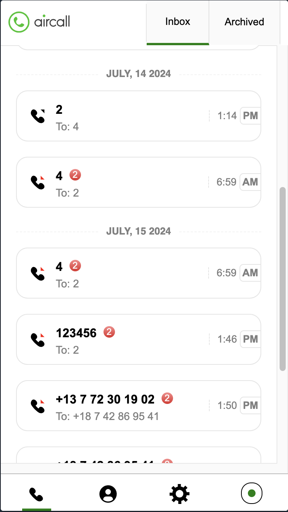

<!-- @format -->

# Aircall app

- [Requirement](https://github.com/speer-technologies/aircall/tree/master)
- Backend api: https://aircall-backend.onrender.com/activities

## Run app

In the project directory, you can run:

### `npm install`

It will install all of dependencies, including

- react: 18.3.1
- react-redux: 9.1.2
- redux: 5.0.1
- redux-thunk": 3.1.0

**Note** The project requires node 18

### `npm start`

Runs the app in the development mode.\
Open [http://localhost:3000](http://localhost:3000) to view it in the browser.

## Demo

Open [the demo](https://aircall-da22c.web.app/) here

#### Aircall Dashboard

